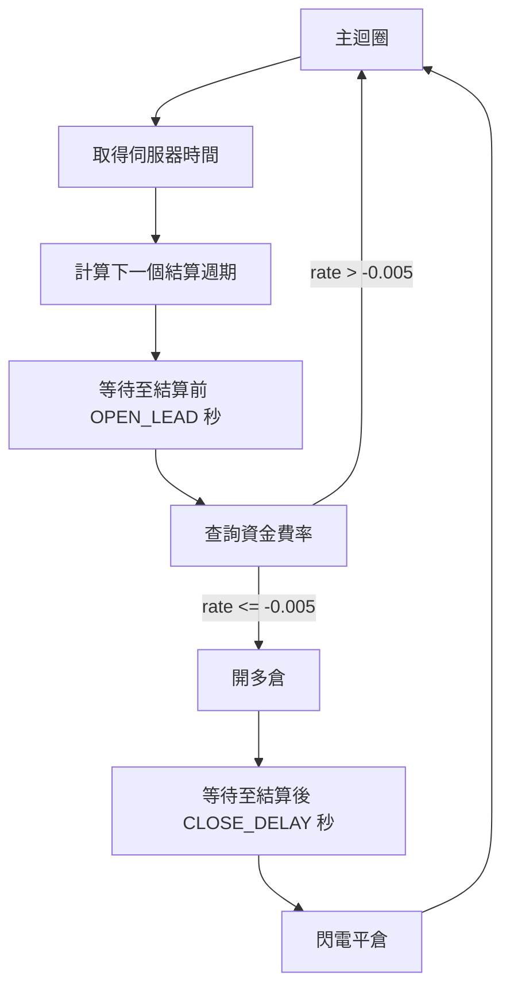

# MEXC-Arbitrage

MEXC 合約資金費率套利機器人。在每個資金費率結算週期前，自動偵測負資金費率並開倉做多，結算後立即平倉，賺取資金費率差額。透過 `undetected_chromedriver` 操作瀏覽器完成下單，規避反爬蟲機制。

## 交易邏輯



## 專案結構

```
MEXC-Arbitrage/
├── main.py          # 主程式：API 查詢、時間計算、交易主迴圈
├── MEXCDriver.py    # Selenium 瀏覽器驅動封裝（買入/賣出/平倉/滑桿控制）
├── LICENSE           # MIT License
└── README.md
```

## 環境需求

- Python 3.10+
- Google Chrome 瀏覽器
- 已登入 MEXC 帳號的 Chrome User Data 目錄

## 安裝

```bash
pip install requests undetected-chromedriver selenium
```

## 設定

開啟 `main.py`，修改頂部參數：

| 參數 | 預設值 | 說明 |
|------|--------|------|
| `SYMBOL` | `ASR_USDT` | 交易對 |
| `OPEN_LEAD` | `10` | 結算前幾秒開倉 |
| `CLOSE_DELAY` | `0` | 結算後幾秒平倉 |
| `CYCLE_HOURS` | `[0,4,8,12,16,20]` | 資金費率結算時間（UTC） |

同時需將 `--user-data-dir` 改為你自己的 Chrome 使用者資料路徑：

```python
op.add_argument(r'--user-data-dir=C:\your\path\to\chrome_userdata')
```

## 執行

```bash
python main.py
```

程式啟動後會自動開啟 Chrome 前往 MEXC 合約交易頁面，並進入無限迴圈：

1. 取得 MEXC 伺服器時間，計算下一個資金費率結算時間點
2. 等待至結算前 `OPEN_LEAD` 秒
3. 查詢當前資金費率，若 <= -0.005 則開多倉
4. 等待至結算後 `CLOSE_DELAY` 秒，閃電平倉
5. 回到步驟 1

## 風險警告

本工具僅供學習與研究用途。加密貨幣合約交易具有高風險，使用自動化交易可能導致資金損失。請自行承擔所有交易風險。

## License

[MIT](LICENSE)
